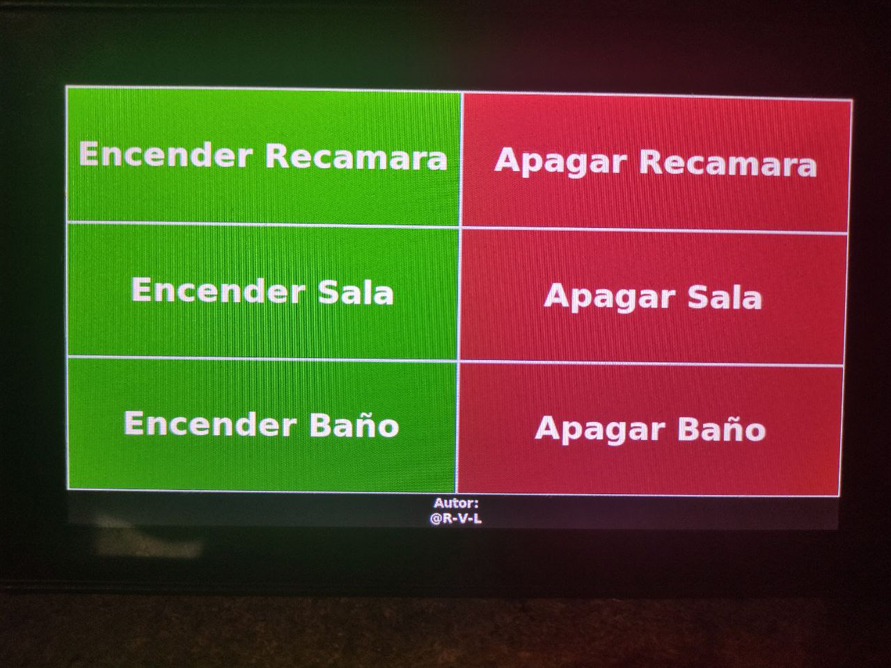
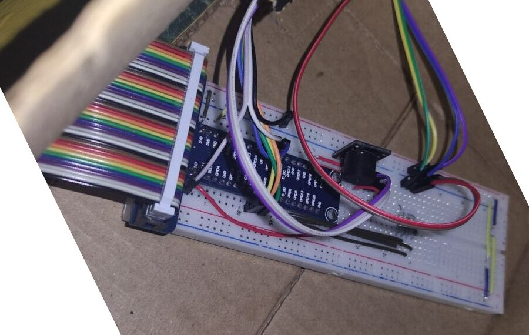

# Domotica con Python y Raspberry PI

Proyecto final para clase de metodos numericos, ingenieria Mecatronica.  
El proyecto fue escrito enteramente en Python a lo largo de aproximadamente 2 semanas, en las que se cambiaron multiples cosas (inicialmente en lugar de notificaciones por medio de Telegram se iba a agregar una bitacora en Google Sheets, la interfaz se habia escrito en un principio en HTML y Javascript, se habia creado un API para manipular los LED, el cual fue eliminado al reescribir la interfaz en Tkinter, etc).

## Imagenes




## Caracteristicas
* Acceso mediante tag RFID
* Controles de apagado y encendido por medio de pantalla tactil
* Detector de intrusos por medio de un sensor infrarrojo, al detectar movimiento se activa una alarma
* Notificaciones al telefono por medio de un bot de Telegram

## Materiales

* Raspberry PI 3B+
* SmartiPi Touch
* Fuente de alimentacion de 5v 3A
* GPIO tipo T + cable 40 pines
* LED
* Buzzer
* Cables jumper macho-hembra
* Lector RFID RC522
* 3 resistencias de 220 Ω
* Sensor infrarrojo FC-51

## Diagrama

Pendiente...

## Recomendaciones
* Instalar [DietPi](https://dietpi.com/) en lugar de Raspberry Pi OS, al no tener que cargar una interfaz completa mantendremos un consumo y temperaturas considerablemente mas bajas.  
    * En caso de hacer esto necesitaremos instalar un gestor de ventanas y Xorg por nuestra cuenta. Con el siguiente comando se instalara tanto Xorg como Openbox:

        ```bash
        sudo apt-get install --no-install-recommends xserver-xorg x11-xserver-utils xinit openbox
        ```
* Usar VS Code con [remote development por medio de SSH](https://code.visualstudio.com/docs/remote/ssh-tutorial) facilita bastante en caso que se requieran hacer modificaciones al codigo.
* En caso de no contar con alguno de los materiales anteriores se pueden reemplazar por otros, por ejemplo, usar otro modelo de lector RFID o un sensor ultrasonico en lugar del sensor infrarrojo. En caso de hacer esto es necesario hacer cambios en el archivo gpiohelper.py

## Instalacion

Descargar o clonar proyecto en Raspberry Pi, hacer cd a la carpeta he instalar los paquetes necesarios con el siguiente comando:

```bash
pip install -r requirements.txt
```
La instalacion debera realizarse en la Raspberry PI.

## Uso

Una vez habiendo realizado las conexiones necesarias, haber clonado el proyecto he instalar los paquetes necesarios, sera necesario iniciar el proyecto main.py el cual contiene la interfaz.  
Por defecto inicia en modo pantalla completa ya que esta pensado para ser usado de este modo, en caso de querer usarlo en modo ventana se necesita cambiar la linea:
```python
window.attributes("-fullscreen", True)
```
Del archivo main a False, o en su defecto comentar o eliminar esa linea.  
Para iniciar desde consola se debe usar el siguiente comando:

```bash
startx /usr/bin/python3 "/root/Proyecto/main.py"
```
(el path puede cambiar, ajustar dependiendo donde se haya clonado el proyecto).  
Tambien es recomendable deshabilitar el cursor para que la interfaz se vea mas limpia, esto se hace agregando el parametro -nocursor a startx.

## Licencia
[MIT License](https://choosealicense.com/licenses/mit/)

Permission is hereby granted, free of charge, to any person obtaining a copy
of this software and associated documentation files (the "Software"), to deal
in the Software without restriction, including without limitation the rights
to use, copy, modify, merge, publish, distribute, sublicense, and/or sell
copies of the Software, and to permit persons to whom the Software is
furnished to do so, subject to the following conditions:

The above copyright notice and this permission notice shall be included in all
copies or substantial portions of the Software.

THE SOFTWARE IS PROVIDED "AS IS", WITHOUT WARRANTY OF ANY KIND, EXPRESS OR
IMPLIED, INCLUDING BUT NOT LIMITED TO THE WARRANTIES OF MERCHANTABILITY,
FITNESS FOR A PARTICULAR PURPOSE AND NONINFRINGEMENT. IN NO EVENT SHALL THE
AUTHORS OR COPYRIGHT HOLDERS BE LIABLE FOR ANY CLAIM, DAMAGES OR OTHER
LIABILITY, WHETHER IN AN ACTION OF CONTRACT, TORT OR OTHERWISE, ARISING FROM,
OUT OF OR IN CONNECTION WITH THE SOFTWARE OR THE USE OR OTHER DEALINGS IN THE
SOFTWARE.